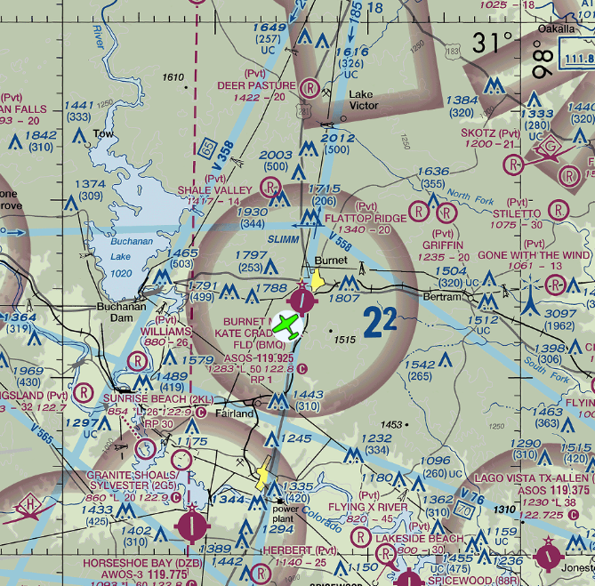
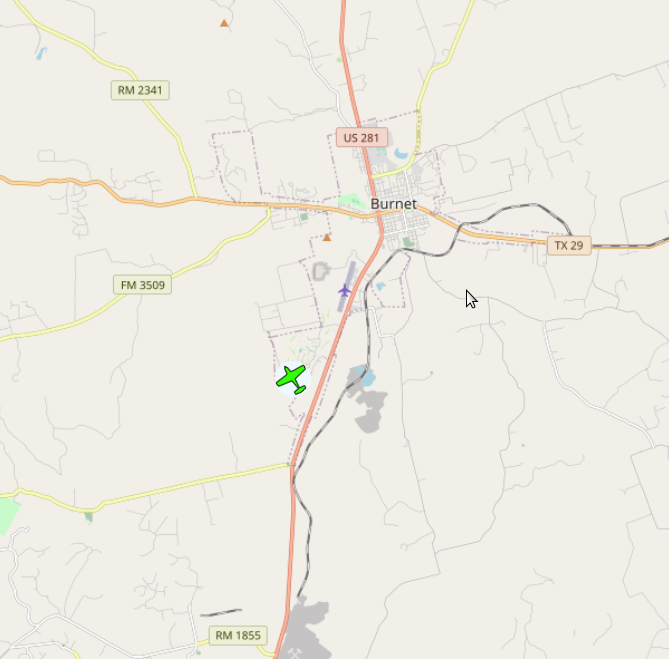

# FAA VFR navigation charts using OpenLayers maps, with optional connection to Stratux for ownship GPS coordinates         

**See http://github.con/N129BZ/VfrSecChartMaker for an automated FAA chart processor**                   
                                         
**Web-based application can use either offline VFR Charts or online OSM maps. Application built with node.js express and OpenLayers. Offline VFR charts use usavfr.mbtiles database. Application polls Stratux GPS/AHRS data to plot ownship position and heading over the map, giving basic "moving map" functionality. Also saves position data in a separate history database at user-defined intervals.**   

###
Offline use requires usavfr.mbtiles database (or a mbtiles database of your own choosing) to be placed in the ./public/data/ folder.

**Instructions:** This is a node app, so you will need node.js installed. Clone this project, open a terminal in the folder you cloned it to, and enter "npm install". You can then either run the application directly from Visual Studio Code, or enter "node index.js" in the terminal. 

**Download the usavfr.mbtiles database (5gb):** https://drive.google.com/file/d/134feGg9nUAHmozji1AtMEUsjtuRnMefl/view?usp=sharing

###
**User-settable values in settings.json:**
```
{
    "putpositionhistory": false,
    "histintervalmsec": 15000,
    "getgpsfromstratux": false,
    "gpsintervalmsec": 1000,
    "getmetars": false,
    "metarintervalmsec": 300000,
    "httpport": 8080,
    "startupzoom": 10,
    "useOSMonlinemap": false,
    "tiledb": "./public/data/usavfr.mbtiles",
    "historydb": "./public/data/positionhistory.db",
    "airportdb": "./public/data/airports.db",
    "stratuxurl": "http://192.168.10.1/getSituation",
    "lockownshiptocenter": true,
    "ownshipimage": "airplane.png"
}
```
**NOTE**: As the position history database is empty at first run of the app, the setting ***"lockownshiptocenter"*** has been set to ***true*** by default. This will allow the application to generate and save some position data so that there will be "last known" longitude and latitude coordinates saved in the database. Once there is at least one position history record, you can change that setting to false so that you can pan around the map without it automatically re-centering ownship to the center.       

###
**References:**

https://github.com/cyoung/stratux/    
https://openlayers.org/     

###
**usavfr.mbtiles rendering (offline)**  
  
**OpenStreetMaps rendering (online only)**  

