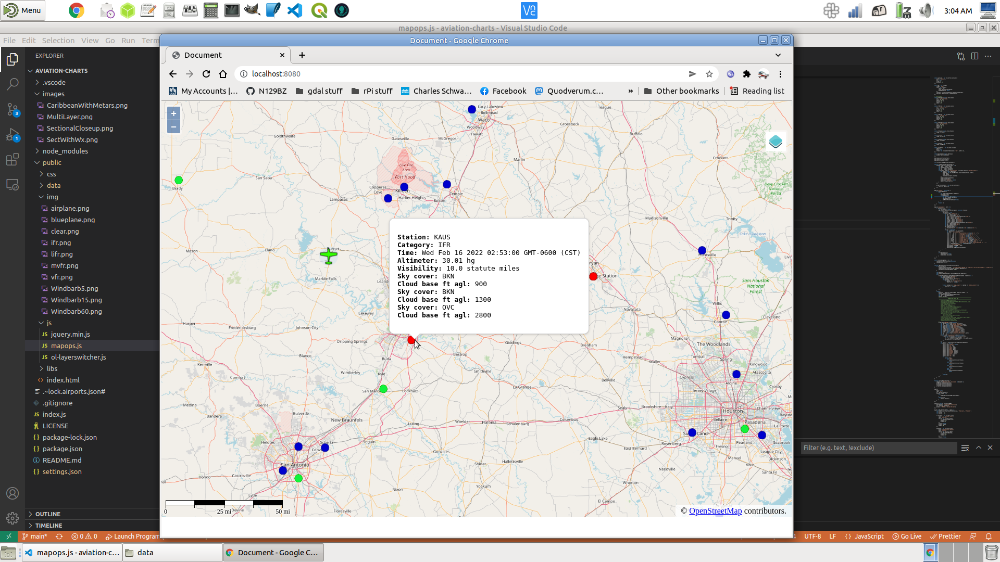
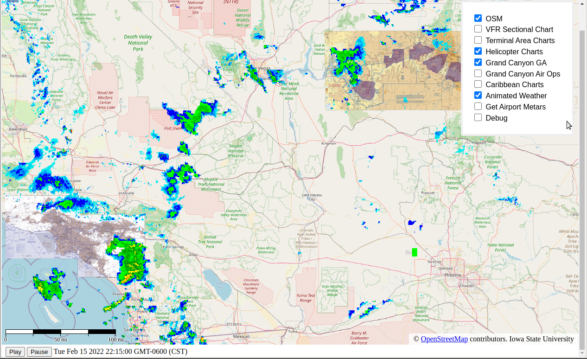
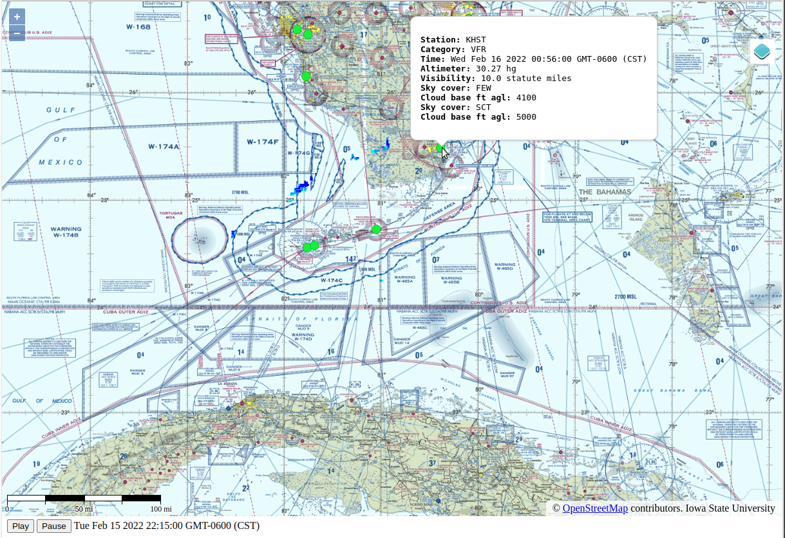
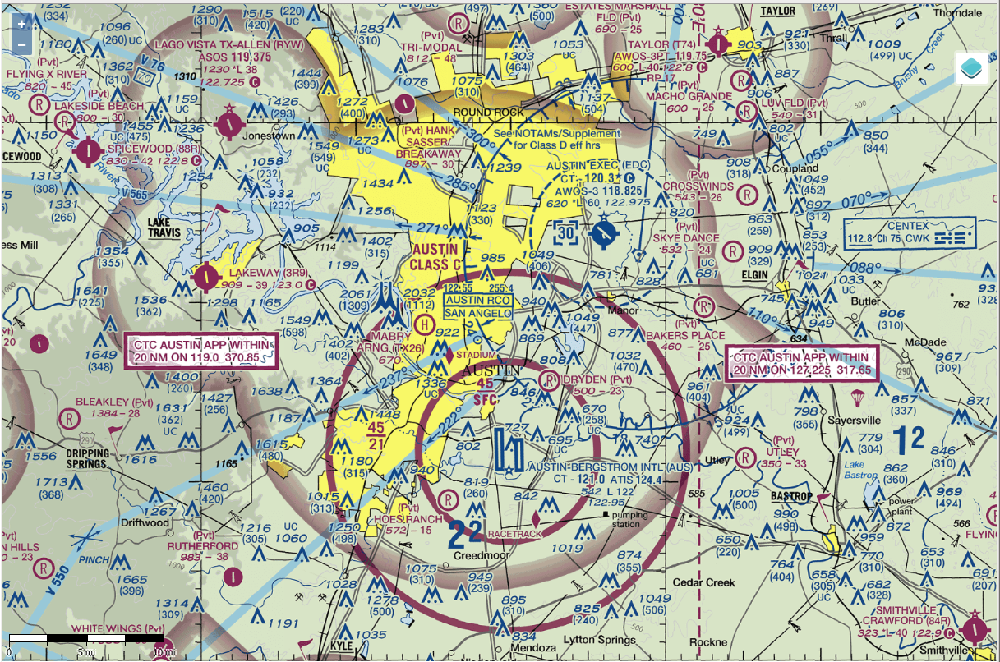

## This web-based application displays FAA charts, OpenStreetMaps, animated weather, and much more, using node.js express and the OpenLayers map API.        
### Offline FAA charts include Sectional, Terminal, Helicopter, Caribbean,and both versions of Grand Canyon charts served from mbtiles databases. It can also poll Stratux GPS/AHRS data to plot ownship position and heading over the map, giving basic "moving map" functionality. It can also save position data in a separate history database at user-defined intervals.   

**See https://github.com/N129BZ/ChartMaker for an automated FAA chart mbtiles processor**

**Instructions:** Obviously since this is a node app, you will need node.js installed. Clone this project, open a terminal in the folder you cloned it to, and enter "npm install". You can then either run the application directly from Visual Studio Code, or enter "node index.js" in the terminal. 

###
**User-editable values in settings.json:**
```
{
    "putpositionhistory": false,
    "histintervalmsec": 15000,
    "getgpsfromstratux": false,
    "gpsintervalmsec": 1000,
    "getmetars": false,
    "metarintervalmsec": 300000,
    "httpport": 8080,
    "startupzoom": 10,
    "useOSMonlinemap": true,
    "debug": false,
    "sectionalDb": "Sectional.mbtiles",
    "terminalDb": "Terminal.mbtiles",
    "helicopterDb": "Helicopter.mbtiles",
    "caribbeanDb": "Caribbean.mbtiles",
    "gcanyonAoDb": "Grand_Canyon_AO.mbtiles",
    "gcanyonGaDb": "Grand_Canyon_GA.mbtiles",
    "historyDb": "positionhistory.db",
    "airportsDb": "airports.db",
    "stratuxurl": "http://192.168.10.1/getSituation",
    "weatherurl": "https://mesonet.agron.iastate.edu/cgi-bin/wms/nexrad/n0r-t.cgi",
    "lockownshiptocenter": true,
    "ownshipimage": "blueplane.png"
}
```
**NOTE**: As the position history database is empty at first run of the app, the setting ***"lockownshiptocenter"*** has been set to ***true*** by default. This will allow the application to generate and save some position data so that there will be "last known" longitude and latitude coordinates saved in the database. Once there is at least one position history record, you can change that setting to false so that you can pan around the map without it automatically re-centering ownship to the center. You could also use a sqlite database tool to enter a position history record with your preferred latitude and longitude to be used as a center point when the maps are loaded.      

###
**References:**

https://github.com/cyoung/stratux/    
https://openlayers.org/     

###
**Animated weather radar layer over the Sectional chart**

**OpenStreetMap with airport status colored markers and METAR popup**

**Multiple layers, layer switcher has OSM, Grand Canyon GA, Helicopter, and animated weather selected**

**Caribbean chart with color-coded airport features, showing a METAR when hovering mouse over an airport**

**Sectional chart zoomed in**  

